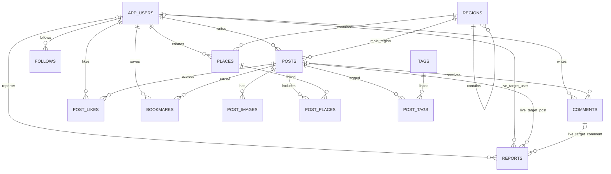
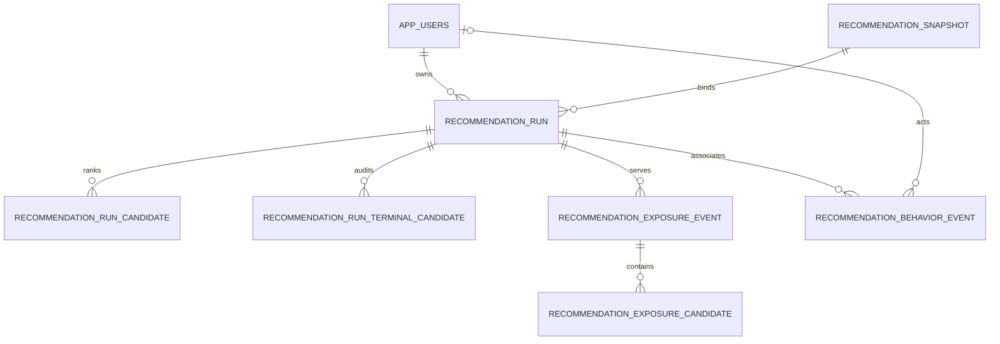

# Journey Connect DB v1.9 ERD



`reports`는 원본 대상이 존재하는 동안 선택적 FK를 유지합니다. 원본이 삭제되면 FK는 `NULL`이 되지만 `target_type`, `target_entity_id`, `target_snapshot`은 남습니다.

`admin_actions`는 장기 감사 보존을 위해 대상 FK를 두지 않고 대상 ID와 JSON 스냅샷만 저장합니다.

피드와 탐색은 별도 테이블이 아닙니다. 동일한 `posts`를 지역·정렬 조건과 `moderation_status = 'visible'` 조건으로 조회합니다.

## 권한 경계

```text
일반 API 로그인 ── jc_app ───── 일반 콘텐츠 CRUD·신고·조회수 함수
인증 API 로그인 ── jc_auth ──── 이메일·비밀번호 해시
관리자 API 로그인 ─ jc_admin ── 관리자 보안 함수 실행
                                  ↓ SECURITY DEFINER
                         jc_security_owner
                                  ↓
             reports / admin_actions / 운영 상태 컬럼
```

## 생명주기 분리

```text
posts.status              draft / published / deleted
posts.moderation_status   visible / hidden

comments.deleted_at                 사용자 논리 삭제
comments.moderation_deleted_at      관리자 운영 삭제
```

운영 제재가 적용된 게시글 본문·상태·이미지·장소·태그와 운영 삭제 댓글은 운영자가 복구하기 전까지 작성자가 변경하거나 복원할 수 없습니다.

## 신고 증거 구조

```text
reports.target_type          대상 종류
reports.target_entity_id     삭제 후에도 남는 대상 ID
reports.target_*_id          원본 생존 중 선택적 FK
reports.target_snapshot      신고 당시 내용 JSON
```

게시글 스냅샷에는 제목·본문·작성자·공개 상태·이미지 URL·장소·태그가 포함됩니다. 실제 이미지 파일의 보존은 외부 스토리지 정책에서 별도로 처리해야 합니다.


## 추천 P0 저장소 ERD



`recommendation_run_candidate.source_entity_id`와 terminal candidate는 삽입 시 게시글이 해당 run 사용자에게 접근 가능하고 공개·운영 노출 상태이며 작성자가 active인지 검사하지만 장기 보존 FK는 두지 않습니다. 게시글 1년 정리 이후에도 run·exposure replay 증거를 유지하기 위한 결정입니다. 정식 identity는 `post:<source_entity_id>`입니다. run은 ranking 입력 3종과 immutable ranking result snapshot을 함께 참조하며, exposure는 run의 user·session·context·surface에 결속됩니다.
