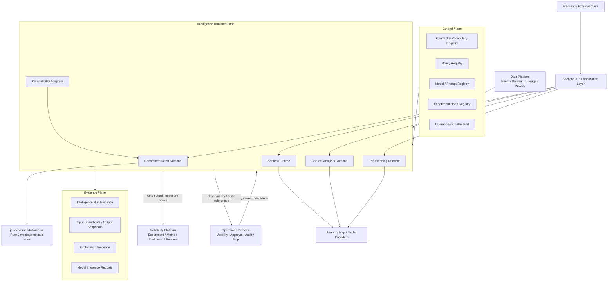

# Intelligence Platform Architecture V1

## 1. 문서 정보

| 항목 | 값 |
|---|---|
| 계약 ID | `intelligence-platform-architecture-v1` |
| 상태 | `ACTIVE DESIGN` |
| 소유 트랙 | Intelligence Platform |
| runtime 기본 | modular monolith + PostgreSQL, stable ports |
| 적용 도메인 | Recommendation, Search, Content Analysis, Trip Planning |

## 2. 논리 아키텍처



## 3. Plane 분리

### 3.1 Runtime plane

Runtime plane은 한 요청 또는 batch 실행에서 실제 Intelligence 결과를 계산한다.

- 도메인 입력 validation
- source snapshot binding
- policy/model/prompt 선택
- retrieval/scoring/ranking/analysis/planning
- fallback·failure 처리
- immutable output evidence 생성

Runtime은 Reliability의 release 결정을 만들지 않고, Data의 raw ingestion을 소유하지 않으며, Operations의 권한 모델을 구현하지 않는다.

### 3.2 Control plane

Control plane은 실행 의미를 결정하는 versioned configuration과 registry를 제공한다.

| 구성 | owner |
|---|---|
| Intelligence contract/run type/feature vocabulary | Intelligence + System Coordination registry |
| ranking/search/planner/content policy | Intelligence |
| model/prompt/tool definition | Intelligence |
| experiment definition/assignment/metric/release | Reliability |
| stop/visibility/approval action | Operations |
| dataset/schema/lineage/privacy classification | Data |

Control plane 값은 runtime에서 문자열 `latest`로 해석하지 않는다. 실행마다 resolved version을 snapshot과 run에 기록한다.

### 3.3 Evidence plane

Evidence plane은 append-only 실행 증거를 의미한다. 하나의 물리 DB schema를 강제하지 않는다.

- `IntelligenceRun`
- `IntelligenceInputSnapshot`
- `CandidateSnapshot`
- `IntelligenceOutputSnapshot`
- `IntelligenceExplanation`
- `ModelInferenceRecord`
- exposure/downstream effect reference

물리 저장 위치와 write owner는 도메인·단계별로 다를 수 있으나 semantic contract는 Common Contracts를 따른다.

## 4. 도메인 분리

### 4.1 Recommendation Runtime

책임:

- profile/context 소비
- candidate generation 또는 retrieval input 소비
- score/rank/diversity/exploration
- fallback
- run/snapshot/exposure 연결

현재 `jc-recommendation-core`와 `com.jc.backend.recommendation`이 reference implementation이다.

### 4.2 Search Runtime

책임:

- query normalization
- retrieval
- filters
- ranking/reranking
- stable pagination
- result/exposure/explanation

Recommendation의 ranking policy와 metric을 재사용하지 않는다. 공통 candidate envelope만 adapter 수준에서 공유할 수 있다.

### 4.3 Content Analysis Runtime

책임:

- tag/place/region/theme extraction
- classification와 quality/risk signal
- structured feature 생성
- model/prompt provenance
- stale/invalidated/human override reference

분석 결과는 사용자 원문과 분리된 파생 결과다.

### 4.4 Trip Planning Runtime

책임:

- place candidate assembly
- time/distance/opening/budget/preference constraint 적용
- itinerary draft와 partial plan
- constraint violation evidence
- fallback·explanation·replay evidence

자유 텍스트 생성만으로 완료된 planner로 간주하지 않는다.

## 5. 현재 물리 구현과 목표 구조

| 논리 기능 | 현재 physical owner/write path | semantic owner | 목표 연결 방식 |
|---|---|---|---|
| P0/P1 recommendation run/snapshot/exposure | recommendation backend + `jc_recommendation` role | Intelligence | compatibility adapter |
| P1 profile snapshot/policy assignment | recommendation package/DB v2.6 | Intelligence | current source 유지, Data shadow 비교 |
| P2 assignment/exposure/evaluation/release | `com.jc.backend.recommendation.p2`, `recommendation_p2_*`, `jc_recommendation` | Reliability 의미, 현재 물리 경로 보호 | 별도 High-risk migration 전까지 유지 |
| Data event/dataset | DP-0 design only | Data | 후속 DP 단계에서 구현 |
| Search | 미구현 | Intelligence | IP 후속 단계 |
| Content Analysis | 미구현 | Intelligence | IP 후속 단계 |
| Trip Planning | 미구현 | Intelligence | place contract 이후 후속 단계 |

## 6. 데이터 흐름

### 6.1 공통 runtime 흐름

```text
API/Application Command
  → identity/authorization resolution
  → immutable input snapshot
  → policy/model/prompt resolution
  → domain runtime
  → candidate/output/explanation snapshot
  → run evidence
  → domain exposure or downstream effect
  → Reliability evaluation hook
  → Operations visibility/audit view
```

### 6.2 Recommendation 현재 흐름

```text
recommendation_behavior_event + content facts + explicit preferences
  → RecommendationP1ProfileSource
  → deterministic profile builder
  → recommendation_p1_profile_snapshot
  → P1 policy selection
  → recommendation_run / snapshots / candidates
  → general recommendation exposure
  → optional P2 assignment-bound experiment exposure
  → P2 evaluation dataset / gates / release evidence
```

이 흐름은 IP-0에서 변경하지 않는다.

### 6.3 Data shadow bridge 흐름

```text
validated behavior stream
  → user behavior aggregate
  → recommendation-profile-input-v1 [shadow]
  → reconciliation against current P1 source

assignment read + authoritative P2 exposure + outcomes
  → experiment-outcome-input-v1 [shadow]
  → reconciliation against recommendation-evaluation-dataset-v1
```

shadow dataset은 runtime authority가 아니다.

## 7. Dependency 방향

### 허용

```text
Backend application
  → Intelligence domain port
  → domain runtime / pure core

Intelligence
  → Data read contract / dataset snapshot
  → Operations visibility/control read port
  → Reliability assignment/evaluation hook
  → external provider adapter
```

### 금지

- Recommendation가 Search 내부 repository를 직접 호출
- Search가 recommendation table을 candidate store로 사용
- Content Analysis가 원문 content row를 직접 overwrite
- Trip Planning이 provider response를 source reference 없이 사실로 저장
- Data가 ranking weight, feature decay, metric definition을 결정
- Intelligence가 Reliability release state를 임의 변경
- Operations가 과거 run/snapshot을 update
- 공통 JPA entity를 여러 트랙이 write
- `jc-recommendation-core`가 Spring/JPA/HTTP/DB/system clock/env에 의존

## 8. 공통 port

IP-0은 구현이 아니라 다음 논리 port를 고정한다.

| port | 제공자 | 소비자 | 의미 |
|---|---|---|---|
| `IntelligenceDatasetPort` | Data | Intelligence | 승인된 versioned dataset/snapshot 읽기 |
| `IdentityMappingReadPort` | System Coordination 지정 owner | 제한된 Intelligence/Reliability | opaque↔legacy identity 매핑 |
| `VisibilityEligibilityPort` | Operations | Recommendation/Search/Planner | 현재 노출 가능성 읽기 |
| `ExperimentAssignmentReadPort` | Reliability 또는 보호된 current P2 path | Intelligence | resolved assignment 읽기 |
| `EvaluationEvidencePort` | Intelligence | Reliability | run/output/exposure evidence 제공 |
| `OperationalControlReadPort` | Operations | Intelligence | stop/hold/override 상태 읽기 |
| `ProviderAdapter` | external integration | Search/Content/Planner | versioned provider response snapshot |

직접 table write는 port로 위장할 수 없다.

## 9. Operations 관측 최소 신호

모든 신규 Intelligence runtime은 가능한 범위에서 다음을 제공한다.

- run ID와 run type
- status와 terminal timestamp
- policy/model/prompt/feature definition/build version
- input/output snapshot reference와 hash
- latency와 provider/tool usage
- fallback/failure code
- privacy-safe subject/entity/surface reference
- safety result
- exposure/downstream effect reference
- replay class와 replay mismatch indicator

Operations는 canonical payload 전체, 사용자 자유 텍스트, raw prompt, 비밀 parameter를 기본 조회하지 않는다.

## 10. Reliability hook

각 도메인은 최소 다음을 Reliability에 제공할 수 있어야 한다.

- experiment/assignment reference
- run type과 policy/model/prompt version
- authoritative exposure 또는 downstream effect reference
- dataset-compatible output identity
- metric definition version binding point
- segment/context dimensions의 승인된 snapshot reference
- fallback/failure guardrail signal

Reliability는 도메인의 scoring 또는 prompt 의미를 직접 변경하지 않는다.

## 11. 확장과 배포 토폴로지

현재는 modular monolith를 기본으로 한다. 다음 조건이 발생할 때만 별도 서비스 분리를 검토한다.

- provider latency와 retry가 backend request isolation을 지속적으로 침해
- 독립 scaling이 측정으로 필요
- data residency 또는 보안 경계가 별도 프로세스를 요구
- queue 기반 장기 실행이 필수
- 장애 blast radius 감소가 운영 비용보다 큼

서비스 분리는 계약 version과 source authority를 바꾸지 않는다.
